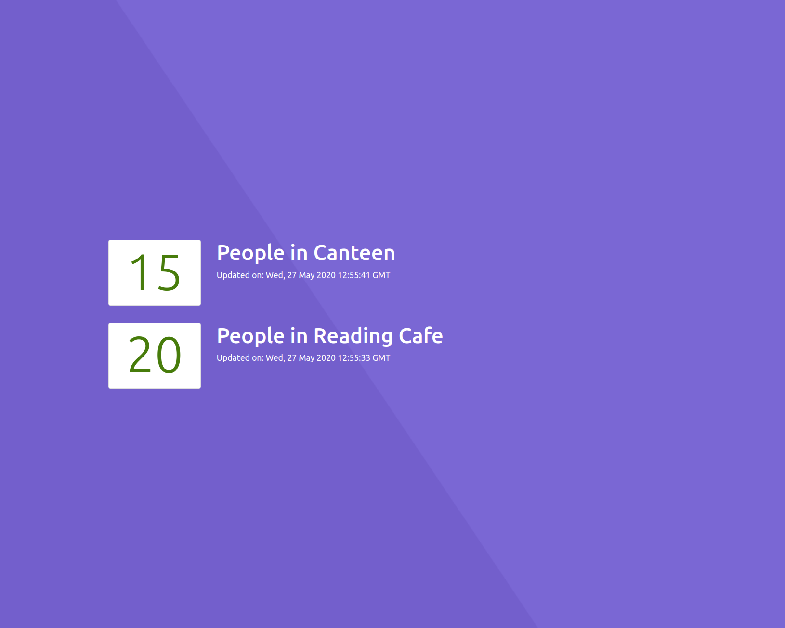

# Digital Counter

A simple app to show a counter. Might be more in the future. Nobody knows.



## Requirements
- docker
- docker-compose
- Ports 3000, 5000,5432,5555 will be used by default, so make sure they are empty

## How to run
1. Duplicate `./server/docker-compose-sample.env` and rename the new file `./server/docker-compose.env`
1. Edit the values in `./server/docker-compose.env`. This file is in `.gitignore` and should not be committed for security reasons 
1. Edit the arguments for `REACT_APP_API_SERVER=http://localhost:5000` in `./docker-compose.yml`. The value should be the URL of your backend server.
1. Make sure that you are in this project's root folder.
1. Build the required containers using:
    ```bash
    docker-compose build
    ```
1. Run all containers using:
    ```bash
    docker-compose up -d
    ```
1. Go to localhost:3000 and you should be able to see the webpage
1. Refer to `./server/readme.md` for instructions for creating superuser and API endpoints
1. To stop all containers, use
    ```bash
    docker-compose down
    ```
#### If you only want to run the server without the webpage

Refer to instructions in `./server/readme.md`

